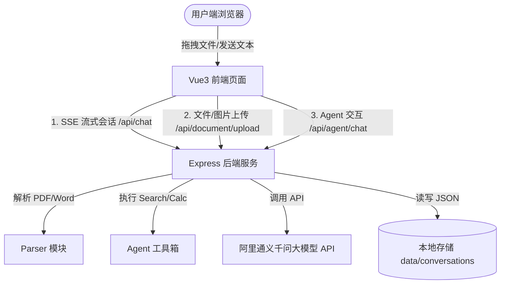

# AI 智能助手平台（Stream-Out）项目功能与架构分析

本项目是一个基于阿里通义千问（Qwen）系列大模型开发的轻量级、多功能 AI 智能助手平台。它集成了**多模态对话、文档解析理解、智能体（Agent）工具调用、会话本地持久化**等主流的大模型应用功能。

---

## 1. 核心功能特性

### 1.1 智能聊天（普通会话）
*   **多模型切换**：支持 `qwen-plus`（推荐）、`qwen-turbo`（快速）、`qwen-max`（最强）、`qwen-long`（长文本）等多种模型，满足不同场景下的速度和智力要求。
*   **SSE 流式输出**：使用 Server-Sent Events (SSE) 技术，大模型的回复逐字流式推送到前端页面，实现零延迟的顺滑交互。
*   **系统提示词（System Prompt）自定义**：用户可以展开提示词控制面板，输入特定的系统人设或指令（如“你是一个翻译官”），实时改变大模型的回答风格和行为规范。
*   **流式中断**：支持在生成过程中随时点击“停止生成”按钮，前端将向后端发起中断信号，强行关闭传输通道，避免浪费 Token。

### 1.2 多模态视觉理解（图片分析）
*   **多格式支持**：支持 JPG、PNG、GIF、WebP 等常见图片格式，限制最大 20MB。
*   **视觉问答（VQA）**：后端调用 `qwen-vl-max` 视觉大模型，用户上传图片后可以针对图片内容进行提问，AI 能够识别图中的物体、文字、场景，并进行细致的中文解答。

### 1.3 智能文档阅读与问答（简易 RAG 流程）
*   **非对称解析**：
    *   **PDF 解析**：采用 `pdf-parse` 解析器，直接提取 PDF 二进制流中的纯文本。
    *   **Word 解析**：采用 `mammoth` 提取器，将 `.doc`/`.docx` 文档中的段落结构完美转为纯文本。
*   **滑动窗口防御**：前端解析完文档后，后端在发送给大模型前自动截取前 **8,000 个字符**，在保障覆盖核心信息的同时防止爆大模型的 Token 上下文窗口限制。
*   **结构化摘要与问答**：利用特定的 System Prompt 约束，模型会自动为用户输出**“文档摘要”**、**“关键要点”**以及针对用户问题的**“详细回答”**。

### 1.4 AI Agent（智能体与 Tool Calling）
*   **自主决策调用**：开启 Agent 模式后，大模型会根据用户的问题（如“北京今天天气怎么样”或“小米集团股票的价格”）自动进行 ReAct 决策，决定是否调用本地工具。
*   **4 大内置工具**：
    *   `search_web`：使用 `searchapi.io` 接口，自动进行 Google 搜索，并获取最新的网页数据及知识图谱，补充时效性信息。
    *   `calculator`：精准的计算器，解决大模型对复杂数学计算容易产生幻觉的痛点。
    *   `weather`：实时天气获取。
    *   `stock`：实时股票行情查询。
*   **二阶段推理**：后端接收到工具执行结果后，再次将上下文发送给大模型做二次总结，最后流式返回给用户。

### 1.5 会话管理与本地持久化
*   **文件存储**：所有对话历史记录不需要依靠繁重的数据库，以 JSON 文件格式直接存储在服务端的 `data/conversations/{id}.json` 路径下。
*   **全生命周期管理**：侧边栏支持新建对话、加载历史对话、清空当前上下文以及删除对话。会话列表按最近更新时间倒序自动排列。

---

## 2. 技术架构设计

项目采用轻量级的前后端分离架构设计：

### 2.1 前端 (ui)
*   **核心框架**：Vue 3 (`<script setup>` 语法糖) + Element Plus (组件库)。
*   **构建工具**：Vite。
*   **排版渲染**：
    *   `marked`：负责把大模型输出的 Markdown 文本解析为 HTML 节点。
    *   `highlight.js`：提供代码块的高亮渲染。

### 2.2 后端 (modules)
*   **核心框架**：Node.js (ES Module) + Express。
*   **依赖库**：
    *   `openai` SDK：使用 OpenAI 兼容模式连接 DashScope 服务。
    *   `multer`：内存级文件上传处理器，避免产生临时垃圾文件。
    *   `pdf-parse` & `mammoth`：处理文档文字提取。

---

## 3. 核心工程优化与交互亮点

1.  **全局拖拽防抖分流**
    *   在前端实现了全局拖拽悬停遮罩层。
    *   采用 **拖拽计数器防抖算法** 解决了在子元素划过时浏览器高频交替触发 `dragenter`/`dragleave` 导致的遮罩层闪烁问题。
    *   智能识别拖拽文件类型：如果是图片则走视觉分析流，如果是 PDF/Word 则自动走文档解析流程。
2.  **网络级流式中断控制**
    *   前端使用 JS 原生 `AbortController` 绑定 fetch 请求。当用户点击“停止生成”时，前端直接 abort 网络请求掐断 TCP 连接。
3.  **排版微调优化**
    *   针对 Markdown 解析出的 HTML 标签之间存在物理换行导致间距过大的问题，在 `.markdown-body` 容器上覆盖 `white-space: normal`，消除了无意义的空行，使对话排版紧凑美观。
